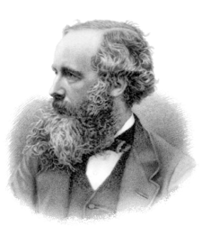

<table class="infobox biography vcard">
<tbody>
<tr>
<th colspan="2">

James Clerk Maxwell

</th>
</tr>
<tr>
<td colspan="2">

James Clerk Maxwell

</td>
</tr>
<tr>
<th scope="row">Born</th>
<td>13 June 1831 

<a title="Edinburgh" href="https://en.wikipedia.org/wiki/Edinburgh">Edinburgh</a>, Scotland, United Kingdom

</td>
</tr>
<tr>
<th scope="row">Died</th>
<td>5 November 1879&nbsp;(aged&nbsp;48) 

<a title="Cambridge" href="https://en.wikipedia.org/wiki/Cambridge">Cambridge</a>, England, United Kingdom

</td>
</tr>
<tr>
<th scope="row">Resting place</th>
<td class="label">Parton, Kirkcudbrightshire <a class="external text" href="https://geohack.toolforge.org/geohack.php?pagename=James_Clerk_Maxwell&amp;params=55.006693_N_4.03921_W_type:landmark" rel="nofollow">55.006693&deg;N 4.039210&deg;W</a></td>
</tr>
<tr>
<th scope="row">Nationality</th>
<td class="category">Scottish</td>
</tr>
<tr>
<th scope="row">Citizenship</th>
<td class="category">British</td>
</tr>
<tr>
<th scope="row">Alma&nbsp;mater</th>
<td><a title="University of Edinburgh" href="https://en.wikipedia.org/wiki/University_of_Edinburgh">University of Edinburgh</a> <a title="University of Cambridge" href="https://en.wikipedia.org/wiki/University_of_Cambridge">University of Cambridge</a></td>
</tr>
<tr>
<th scope="row">Known&nbsp;for</th>
<td><a title="Maxwell's equations" href="https://en.wikipedia.org/wiki/Maxwell%27s_equations">Maxwell's equations</a> <a title="Maxwell relations" href="https://en.wikipedia.org/wiki/Maxwell_relations">Maxwell relations</a> <a class="mw-redirect" title="Maxwell distribution" href="https://en.wikipedia.org/wiki/Maxwell_distribution">Maxwell distribution</a> <a title="Maxwell's demon" href="https://en.wikipedia.org/wiki/Maxwell%27s_demon">Maxwell's demon</a> <a class="mw-redirect" title="Maxwell's discs" href="https://en.wikipedia.org/wiki/Maxwell%27s_discs">Maxwell's discs</a> <a class="mw-redirect" title="Maxwell speed distribution" href="https://en.wikipedia.org/wiki/Maxwell_speed_distribution">Maxwell speed distribution</a> <a title="Maxwell's theorem" href="https://en.wikipedia.org/wiki/Maxwell%27s_theorem">Maxwell's theorem</a> <a title="Maxwell material" href="https://en.wikipedia.org/wiki/Maxwell_material">Maxwell material</a> <a title="Generalized Maxwell model" href="https://en.wikipedia.org/wiki/Generalized_Maxwell_model">Generalized Maxwell model</a> <a title="Displacement current" href="https://en.wikipedia.org/wiki/Displacement_current">Displacement current</a> <a title="Maxwell coil" href="https://en.wikipedia.org/wiki/Maxwell_coil">Maxwell coil</a> Maxwell's wheel</td>
</tr>
<tr>
<th scope="row">Spouse(s)</th>
<td><a title="Katherine Clerk Maxwell" href="https://en.wikipedia.org/wiki/Katherine_Clerk_Maxwell">Katherine Clerk Maxwell</a></td>
</tr>
<tr>
<th scope="row">Awards</th>
<td><a class="mw-redirect" title="FRSE" href="https://en.wikipedia.org/wiki/FRSE">FRSE</a> <a title="Fellow of the Royal Society" href="https://en.wikipedia.org/wiki/Fellow_of_the_Royal_Society">FRS</a> <a title="Smith's Prize" href="https://en.wikipedia.org/wiki/Smith%27s_Prize">Smith's Prize</a>&nbsp;(1854) <a title="Adams Prize" href="https://en.wikipedia.org/wiki/Adams_Prize">Adams Prize</a>&nbsp;(1857) <a title="Rumford Medal" href="https://en.wikipedia.org/wiki/Rumford_Medal">Rumford Medal</a>&nbsp;(1860) <a class="mw-redirect" title="Keith Prize" href="https://en.wikipedia.org/wiki/Keith_Prize">Keith Prize</a>&nbsp;(1869&ndash;71)</td>
</tr>
<tr>
<td colspan="2"><strong>Scientific career</strong></td>
</tr>
<tr>
<th scope="row">Fields</th>
<td class="category"><a title="Physics" href="https://en.wikipedia.org/wiki/Physics">Physics</a>&nbsp;and&nbsp;<a title="Mathematics" href="https://en.wikipedia.org/wiki/Mathematics">mathematics</a></td>
</tr>
<tr>
<th scope="row">Institutions</th>
<td><a title="Marischal College" href="https://en.wikipedia.org/wiki/Marischal_College">Marischal College</a>,&nbsp;<a title="University of Aberdeen" href="https://en.wikipedia.org/wiki/University_of_Aberdeen">University of Aberdeen</a> <a class="mw-redirect" title="King's College, London" href="https://en.wikipedia.org/wiki/King%27s_College,_London">King's College, London</a> <a title="University of Cambridge" href="https://en.wikipedia.org/wiki/University_of_Cambridge">University of Cambridge</a></td>
</tr>
<tr>
<th scope="row">Academic advisors</th>
<td><a title="William Hopkins" href="https://en.wikipedia.org/wiki/William_Hopkins">William Hopkins</a></td>
</tr>
<tr>
<th scope="row">Notable students</th>
<td><a title="George Chrystal" href="https://en.wikipedia.org/wiki/George_Chrystal">George Chrystal</a> <a title="Horace Lamb" href="https://en.wikipedia.org/wiki/Horace_Lamb">Horace Lamb</a> <a title="John Henry Poynting" href="https://en.wikipedia.org/wiki/John_Henry_Poynting">John Henry Poynting</a></td>
</tr>
<tr>
<th scope="row">Influences</th>
<td><a class="mw-redirect" title="Sir Isaac Newton" href="https://en.wikipedia.org/wiki/Sir_Isaac_Newton">Sir Isaac Newton</a>,&nbsp;<a title="Michael Faraday" href="https://en.wikipedia.org/wiki/Michael_Faraday">Michael Faraday</a></td>
</tr>
<tr>
<th scope="row">Influenced</th>
<td>Virtually all subsequent&nbsp;<a title="Physics" href="https://en.wikipedia.org/wiki/Physics">physics</a></td>
</tr>
<tr>
<th colspan="2">Signature</th>
</tr>
<tr>
<td colspan="2"></td>
</tr>
</tbody>
</table>
 

<strong>James Clerk Maxwell</strong>&nbsp;<a class="mw-redirect" title="Fellow of the Royal Society of Edinburgh" href="https://en.wikipedia.org/wiki/Fellow_of_the_Royal_Society_of_Edinburgh">FRSE</a>&nbsp;<a title="Fellow of the Royal Society" href="https://en.wikipedia.org/wiki/Fellow_of_the_Royal_Society">FRS</a>&nbsp;(13 June 1831&nbsp;&ndash; 5 November 1879) was a Scottish&nbsp;<a title="Scientist" href="https://en.wikipedia.org/wiki/Scientist">scientist</a>&nbsp;in the field of&nbsp;<a title="Mathematical physics" href="https://en.wikipedia.org/wiki/Mathematical_physics">mathematical physics</a>.&nbsp;His most notable achievement was to formulate the&nbsp;<a class="mw-redirect" title="Classical theory" href="https://en.wikipedia.org/wiki/Classical_theory">classical theory</a>&nbsp;of&nbsp;<a title="Electromagnetic radiation" href="https://en.wikipedia.org/wiki/Electromagnetic_radiation">electromagnetic radiation</a>, bringing together for the first time electricity,&nbsp;<a title="Magnetism" href="https://en.wikipedia.org/wiki/Magnetism">magnetism</a>, and light as different manifestations of the same phenomenon.&nbsp;<a title="Maxwell's equations" href="https://en.wikipedia.org/wiki/Maxwell%27s_equations">Maxwell's equations</a>&nbsp;for electromagnetism have been called the "<a class="mw-redirect" title="Unification (physics)" href="https://en.wikipedia.org/wiki/Unification_(physics)">second great unification in physics</a>"&nbsp;where the first one had been realised by&nbsp;<a title="Isaac Newton" href="https://en.wikipedia.org/wiki/Isaac_Newton">Isaac Newton</a>.

With the publication of "<a title="A Dynamical Theory of the Electromagnetic Field" href="https://en.wikipedia.org/wiki/A_Dynamical_Theory_of_the_Electromagnetic_Field">A Dynamical Theory of the Electromagnetic Field</a>" in 1865, Maxwell demonstrated that&nbsp;<a class="mw-redirect" title="Electric force" href="https://en.wikipedia.org/wiki/Electric_force">electric</a>&nbsp;and&nbsp;<a title="Magnetic field" href="https://en.wikipedia.org/wiki/Magnetic_field">magnetic fields</a>&nbsp;travel through space as&nbsp;<a title="Wave" href="https://en.wikipedia.org/wiki/Wave">waves</a>&nbsp;moving at the&nbsp;<a title="Speed of light" href="https://en.wikipedia.org/wiki/Speed_of_light">speed of light</a>.&nbsp;He proposed that light is an undulation in the same medium that is the cause of electric and magnetic phenomena.&nbsp;The unification of light and electrical phenomena led his prediction of the existence of&nbsp;<a class="mw-redirect" title="Radio waves" href="https://en.wikipedia.org/wiki/Radio_waves">radio waves</a>. Maxwell is also regarded as a founder of the modern field of&nbsp;<a title="Electrical engineering" href="https://en.wikipedia.org/wiki/Electrical_engineering">electrical engineering</a>.

He helped develop the&nbsp;<a title="Maxwell&ndash;Boltzmann distribution" href="https://en.wikipedia.org/wiki/Maxwell%E2%80%93Boltzmann_distribution">Maxwell&ndash;Boltzmann distribution</a>, a statistical means of describing aspects of the&nbsp;<a title="Kinetic theory of gases" href="https://en.wikipedia.org/wiki/Kinetic_theory_of_gases">kinetic theory of gases</a>. He is also known for presenting the first durable&nbsp;<a class="mw-redirect" title="Colour photograph" href="https://en.wikipedia.org/wiki/Colour_photograph">colour photograph</a>&nbsp;in 1861 and for his foundational work on analysing the&nbsp;<a title="Structural rigidity" href="https://en.wikipedia.org/wiki/Structural_rigidity">rigidity</a>&nbsp;of rod-and-joint frameworks (<a title="Truss" href="https://en.wikipedia.org/wiki/Truss">trusses</a>) like those in many bridges.

His discoveries helped usher in the era of modern physics, laying the foundation for such fields as&nbsp;<a title="Special relativity" href="https://en.wikipedia.org/wiki/Special_relativity">special relativity</a>&nbsp;and&nbsp;<a title="Quantum mechanics" href="https://en.wikipedia.org/wiki/Quantum_mechanics">quantum mechanics</a>. Many physicists regard Maxwell as the 19th-century scientist having the greatest influence on 20th-century physics. His contributions to the science are considered by many to be of the same magnitude as those of Isaac Newton and&nbsp;<a title="Albert Einstein" href="https://en.wikipedia.org/wiki/Albert_Einstein">Albert Einstein</a>.&nbsp;In the millennium poll&mdash;a survey of the 100 most prominent physicists&mdash;Maxwell was voted the third greatest physicist of all time, behind only Newton and Einstein.&nbsp;On the centenary of Maxwell's birthday, Einstein described Maxwell's work as the "most profound and the most fruitful that physics has experienced since the time of Newton".&nbsp;Einstein, when he visited the University of Cambridge in 1922, was told by his host that he had done great things because he stood on Newton's shoulders; Einstein replied: "No I don't. I stand on the shoulders of Maxwell."

 

<strong> Publications: </strong>

<ul>
<li><a target="_blank" href="https://github.com/manjunath5496/James-Clerk-Maxwell-Books/blob/master/mw(1).pdf" style="text-decoration:none;">The Dynamical Theory of the Electromagnetic Field</a></li>
<li><a target="_blank" href="https://github.com/manjunath5496/James-Clerk-Maxwell-Books/blob/master/mw(2).pdf" style="text-decoration:none;">An Elementary Treatise on Electricity</a></li>
  <li><a target="_blank" href="https://github.com/manjunath5496/James-Clerk-Maxwell-Books/blob/master/mw(3).pdf" style="text-decoration:none;">A Treatise on Electricity and Magnetism</a></li>
 <li><a target="_blank" href="https://github.com/manjunath5496/James-Clerk-Maxwell-Books/blob/master/mw(4).pdf" style="text-decoration:none;">Theory of Heat  </a></li>                              
<li><a target="_blank" href="https://github.com/manjunath5496/James-Clerk-Maxwell-Books/blob/master/mw(5).pdf" style="text-decoration:none;">Matter and Motion</a></li>
<li><a target="_blank" href="https://github.com/manjunath5496/James-Clerk-Maxwell-Books/blob/master/mw(6).pdf" style="text-decoration:none;">On the stability of the motion of Saturn's rings</a></li>
<li><a target="_blank" href="https://github.com/manjunath5496/James-Clerk-Maxwell-Books/blob/master/mw(7).pdf" style="text-decoration:none;">Five of Maxwell's Papers</a></li>
  

 <li><a target="_blank" href="https://github.com/manjunath5496/James-Clerk-Maxwell-Books/blob/master/m(1).pdf" style="text-decoration:none;">On the Dynamical Theory of Gases</a></li>

 <li><a target="_blank" href="https://github.com/manjunath5496/James-Clerk-Maxwell-Books/blob/master/m(2).pdf" style="text-decoration:none;">Thomson and Tait's Natural Philosophy</a></li>

<li><a target="_blank" href="https://github.com/manjunath5496/James-Clerk-Maxwell-Books/blob/master/m(3).pdf" style="text-decoration:none;">On the Equilibrium of Elastic Solids </a></li>
 <li><a target="_blank" href="https://github.com/manjunath5496/James-Clerk-Maxwell-Books/blob/master/m(4).pdf" style="text-decoration:none;">On Reciprocal Figures, Frames, and Diagrams of Forces</a></li>                              
<li><a target="_blank" href="https://github.com/manjunath5496/James-Clerk-Maxwell-Books/blob/master/m(5).pdf" style="text-decoration:none;">Illustrations of the dynamical theory of gases</a></li>
<li><a target="_blank" href="https://github.com/manjunath5496/James-Clerk-Maxwell-Books/blob/master/m(6).pdf" style="text-decoration:none;">Experiments on colour, as perceived by the eye, with remarks on colour-blindness</a></li>
 <li><a target="_blank" href="https://github.com/manjunath5496/James-Clerk-Maxwell-Books/blob/master/m(7).pdf" style="text-decoration:none;">On the Motions and Collisions of Perfectly Elastic Spheres</a></li>

 <li><a target="_blank" href="https://github.com/manjunath5496/James-Clerk-Maxwell-Books/blob/master/m(8).pdf" style="text-decoration:none;"> On physical lines of force </a></li>
   <li><a target="_blank" href="https://github.com/manjunath5496/James-Clerk-Maxwell-Books/blob/master/m(9).pdf" style="text-decoration:none;">On the Stability of the Motion of Saturn's Rings</a></li>
  
   
 <li><a target="_blank" href="https://github.com/manjunath5496/James-Clerk-Maxwell-Books/blob/master/m(10).pdf" style="text-decoration:none;">On Double Refraction in a Viscous Fluid in motion</a></li>                              
<li><a target="_blank" href="https://github.com/manjunath5496/James-Clerk-Maxwell-Books/blob/master/m(11).pdf" style="text-decoration:none;">On the theory of compound colours, and the relations of the colours of the spectrum</a></li>
<li><a target="_blank" href="https://github.com/manjunath5496/James-Clerk-Maxwell-Books/blob/master/m(12).pdf" style="text-decoration:none;">The Bakerian Lecture — On the viscosity or internal friction of air and other gases</a></li>
<li><a target="_blank" href="https://github.com/manjunath5496/James-Clerk-Maxwell-Books/blob/master/m(13).pdf" style="text-decoration:none;">On stresses in rarified gases arising from inequalities of temperature</a></li>
  
  
  
  
  
  </ul>
